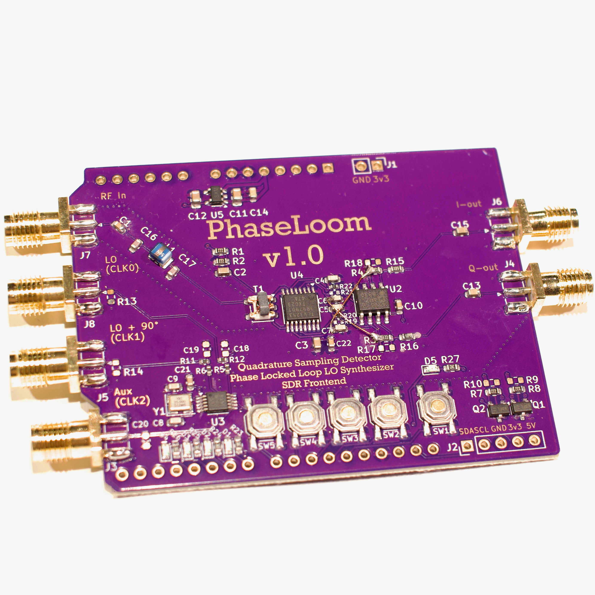

# PhaseLoom

PhaseLoom is a unique Software Defined Radio (SDR) frontend built around the legendary MOS Technology 6502 CPU, celebrating its 50th anniversary. This project combines classic computing with modern SDR techniques, offering a hands-on platform for radio experimentation and development.

## Purchase

Interested in owning a PhaseLoom?  
[Buy one here](https://www.imania.dk/index.php?cPath=204&sort=5a&language=en).

## Project Story & Background
Hello everyone!
I just made the coolest gadget of the year. It’s a Software Defined Radio based on the MOS Technology 6502 CPU, which powered the Apple I & II, Commodore computers, NES, Ataris, and more. This year marks its 50th anniversary!

SDRs are the Swiss Army Knives of radio frequencies. Instead of purpose-built hardware for each use case, SDRs use software to handle filtering and demodulation, making them flexible and upgradable. With PhaseLoom, you get a 6502-based SDR platform—yes, a 6502 SDR!—that lets you experiment with radio signals, decode transponders, listen to shortwave, and more.

The PhaseLoom is designed as an Arduino-style shield for the 65uino, the smallest of my 6502-based computers. It features a Quadrature Sampling Detector, Phase Locked Loop LO Synthesizer, and SDR frontend. The project is open source, and all hardware files, schematics, and source code are available for you to use and modify.

## Features
- KiCad PCB and schematic files
- Gerber files for manufacturing
- Bill of Materials (BOM) and Component Placement List (CPL)
- Images of PCB versions and layouts
- Excel sheet for SI5351 PLL calculations
- Arduino shield form factor for easy integration
- Compatible with 6502, Arduino, ESP32, and other i2c-capable boards

## Technical Highlights
- Quadrature Sampling Detector using Tayloe-style commutating mixers
- SI5351 clock generator for flexible LO generation
- Differential signal processing for improved noise immunity
- Designed for direct conversion SDR and future expansion
- Open source 6502 assembly library for SI5351 control

## Folder Structure
- `PhaseLoom.kicad_pcb` / `PhaseLoom.kicad_sch`: Main PCB and schematic files
- `images/`: Photos and renders of PCB versions
- `jlcpcb/`: Manufacturing files for JLCPCB
  - `gerber/`: Gerber files for PCB fabrication
  - `production_files/`: BOM, CPL, and zipped Gerber files
- `PhaseLoom-backups/`: Backup archives of project versions
- `SI5351_PLL_Calc_Formulas.xlsx`: PLL calculation formulas

## How to Use
[6502 source code still lives over on the 65uino project](https://github.com/AndersBNielsen/65uino/)

The main 65uino firmware currently comes with support for the PhaseLoom built in. Assemble a recent binary and you're good to go. 

The 65uino automatically detects the si5351 and goes into SDR mode, that let's you use the buttons and LED's on the PhaseLoom to tune the channels. 

Leftmost button(1): Channel down
Second button: Unused
Third button: Unused
Fourth button: Channel up
Rightmost button: Tune to selected channel.

LED's show the current channel as a binary count. 

To change the available channels update the source code using the Excel spreadsheet to get new byte values for the lookup tables - let me know if you'd like to see a video about that. 

## Other host hardware?
Want to use the PhaseLoom with something that's not a 6502 computer? Go right ahead and use it with anything that does i2c - even better something that already has an si5351 library. 

## Images
Find PCB photos and renders in the `images/` folder for reference and documentation.

## Getting a PCB

## Production & Manufacturing
- The `jlcpcb/gerber/` folder contains all necessary files for PCB fabrication.
- The `production_files/` folder includes:
  - `BOM-PhaseLoom.csv`: Bill of Materials
  - `CPL-PhaseLoom.csv`: Component Placement List
  - `GERBER-PhaseLoom.zip`: Zipped Gerber files for easy upload

This project is kindly sponsored by JLCPCB. They offer cheap, professional looking PCBs and super fast delivery.

Step 1: Get the gerber file zip package from the /hardware folder

Step 2: Upload to JLCPCB [https://jlcpcb.com/?from=Anders_N](https://jlcpcb.com/?from=Anders_N)

Step 3: Pick your color, surface finish and order.

You can use these affiliate links to get a board for $2 and also get $54 worth of New User Coupons at: https://jlcpcb.com/?from=Anders_N

And in case you also want to order a 3D-printed case you can use this link. 
How to Get a $7 3D Printing Coupon: [https://3d.jlcpcb.com/?from=Anders3DP](https://jlc3dp.com/?from=Anders_N)

---

For more details, technical explanations, and the full story behind PhaseLoom, check out the project video and documentation. Special thanks to JLCPCB and Fnirsi for supporting the development of this project!

